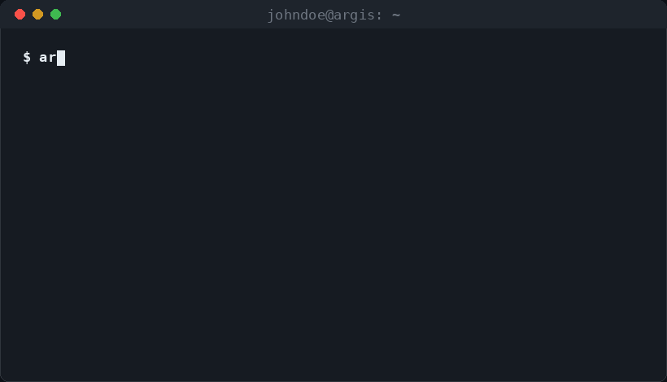

# Argis

[](https://pypi.org/project/argis/)
[](https://pypi.org/project/argis/)
[](https://pypi.org/project/argis/)
[](LICENSE)
[](#)
[](https://github.com/Mohilisop/argis)

**The all-seeing OSINT scanner.** Map a username across 500+ platforms with media enrichment, identity correlation, breach checks, impersonation detection, and footprint drift tracking — in one async CLI.

Named after **Argus Panoptes**, the hundred-eyed giant of Greek myth: every platform, watched at once.

```bash
pip install argis
argis scan johndoe
```

---

## Table of Contents

- [Demo](#demo)
- [Why Argis](#why-argis)
- [Use Cases](#use-cases)
- [Quick Start](#quick-start)
- [Installation](#installation)
- [Features](#features)
- [Intelligence](#intelligence)
- [Media Pipeline](#media-pipeline)
- [Commands](#commands)
- [Documentation](#documentation)
- [Responsible Use](#responsible-use)
- [Contributing](#contributing)
- [Security](#security)
- [Star History](#star-history)
- [License](#license)

---

## Demo



*`argis scan johndoe` — 509 platforms, async, streamed to the terminal as results land.*

> The GIF above is a stylized mockup for illustration. For real footage of your own build, record one with [asciinema](https://asciinema.org), [VHS](https://github.com/charmbracelet/vhs), or [Terminalizer](https://github.com/faressoft/terminalizer) and drop it in at `assets/demo.gif`.

---

## Why Argis

> Sherlock and Maigret answer *does this handle exist here?* Argis answers everything after that: it correlates identities, flags impersonators, tracks drift over time, self-heals its own site rules, exports to HTML/PDF/Neo4j/XMind, and layers in recon, breach, and media tooling — one pipeline instead of five separate tools.

| Feature | Argis | Sherlock | Maigret |
|---|:---:|:---:|:---:|
| Platforms scanned | **509** | ~400 | ~350 |
| Identity correlation (`link`) | ✅ | ❌ | ❌ |
| Impersonation detection (`guard`) | ✅ | ❌ | ❌ |
| Identity drift tracking (`echo`) | ✅ | ❌ | ❌ |
| Self-healing site rules (`doctor`) | ✅ | ❌ | ❌ |
| HTML / PDF / XMind / Neo4j exports | ✅ | ❌ | ❌ |
| Media enrichment + avatar classifier | ✅ | ❌ | ❌ |
| Recon: ports, DNS, WHOIS | ✅ | ❌ | ❌ |
| OCR from screenshots | ✅ | ❌ | ❌ |
| Face detection + reverse search | ✅ | ❌ | ❌ |
| Breach checking | ✅ | ❌ | ❌ |
| Change monitoring | ✅ | ❌ | ❌ |
| LLM risk analysis | ✅ | ❌ | ❌ |
| MCP server (AI integration) | ✅ | ❌ | ❌ |
| Web browser UI | ✅ | ❌ | ❌ |
| Docker support | ✅ | ✅ | ✅ |

---

## Use Cases

**Personal security audit** — `argis me you` shows everywhere your handle exists, checks for breached emails and impersonators, and scores your exposure with a ranked shrink plan.

**Continuous monitoring** — `argis monitor johndoe --interval 86400 --webhook <url>` watches an account daily and pushes an alert the moment something changes.

**Brand & handle protection** — `argis guard yourbrand` generates the full homoglyph / typo-squat space around your handle and flags lookalike accounts before they gain traction.

**Authorized security investigations** — scan a handle in scope for your engagement, pipe results into Neo4j, cross-reference via the MCP server, and export a PDF for case documentation.

**OSINT pivoting** — resolve a handle's identity cluster, outbound links, and geo-hints to map how a public account connects to the rest of its footprint.

**Infrastructure recon** — `argis recon example.com` runs port scanning, service detection, DNS resolution, WHOIS, and geolocation from one CLI, for hosts you own or are authorized to assess.

---

## Quick Start

```bash
pip install argis
argis --version                           # confirm the install
argis scan johndoe                        # surface every account
argis scan johndoe --dossier report.html  # build the full HTML dossier
argis scan johndoe -P report.pdf          # PDF report
argis me johndoe                          # full self-assessment
argis echo johndoe                        # track identity drift over time
argis web                                 # launch the browser UI
```

---

## Installation

```bash
pip install argis                    # base install
pip install "argis[web]"             # + web UI (uvicorn)
pip install "argis[intel]"           # + avatar matching for link/guard
pip install "argis[screenshots]"     # + OCR and screenshots
pip install "argis[vision]"          # + face detection
pip install "argis[insightface]"     # + offline DeepFace matching
pip install "argis[render]"          # + headless browser for JS-gated profiles
pip install "argis[mcp]"             # + MCP server
pip install "argis[pdf]"             # + PDF generation
pip install "argis[dev]"             # + test suite
pip install "argis[all]"             # everything
```

Requires **Python 3.10+**. Supports Windows, Linux, and macOS.

---

## Features

| | |
|---|---|
| 🔍 **509 platforms** | Social, coding, gaming, creative, professional, and more |
| ⚡ **Async engine** | Concurrent scanning with HTTP/2 support and retry-with-backoff |
| 🖼️ **Media enrichment** | Captures real profile photos (GitHub & Instagram first-party APIs) via a classifier that separates true avatars from logos, favicons, and generic Open Graph art |
| 📊 **HTML dossier** | Risk banner, distribution, identity, correlations, captured media, filterable account list — plus PDF, TXT, CSV, Markdown, XMind, GraphML, Neo4j exports |
| 🔁 **Echo identity drift** | Detects coordinated rebrands, avatar migrations, contact pivots, account expansion/retreat across saved scans |
| 🖥️ **Recon** | Nmap-style port scan, service/version detection, OS detection, UDP scan, traceroute, host discovery |
| 🌐 **DNS & WHOIS** | Resolve records, look up domain ownership |
| 🌎 **Geolocation** | IP geolocation via ipgeolocation.io |
| 🕒 **History & diff** | Track changes to a footprint over time |
| 🛰️ **Change monitoring** | Continuously watch usernames and report changes |
| ↔️ **Side-by-side comparison** | Compare two usernames |
| 🎬 **Wayback Machine** | Historical snapshots of profiles |
| 📁 **Multiple outputs** | JSON, CSV, HTML, Markdown, TXT, NDJSON, XMind, GraphML, Neo4j, PDF, webhooks (Slack / Discord) |
| 🧠 **AI analysis** | LLM-powered risk assessment via OpenAI or Anthropic |
| 🤖 **OCR** | Extract usernames from screenshots, auto-scan found handles |
| 📷 **Face detection** | Reverse-search via multiple engines (Google, TinEye, Bing, Yandex, SauceNAO, IQDB, ImgOps); offline DeepFace lookalike matching |
| 🧹 **Self-healing** | Auto-verifies site rules and flags silent rot |
| 🔗 **Identity correlation** | Clusters accounts into real identities vs. impersonators |
| 🛡️ **Impersonation guard** | Hunts lookalike handles wearing your face |
| 🔒 **Breach checker** | Checks whether emails were exposed in known breaches |
| 💬 **Web mentions** | Searches pastes, code, and dorks for a handle |
| 👤 **Unified threat report** | `argis me` consolidates your entire footprint |
| 🔌 **MCP server** | Connects Argis to any MCP-compatible AI assistant |
| 🌐 **Web UI** | Browser mode with live streaming results, category-grouped cards, inline dossier |
| 📸 **Screenshots** | Captures profile pages via Playwright, renders as ANSI art in-terminal |
| 🖥️ **Desktop notifications** | Push notifications on scan completion |

---

## Intelligence

Every username scanner answers one question: *does this handle exist here?* Argis Intelligence answers what comes after.

| Command | What it answers |
|---|---|
| `doctor` | Are my detection rules still correct, or have they silently rotted? |
| `link` | Of everywhere this handle exists, which accounts are the same person — and which are impostors? |
| `guard` | Is anyone impersonating me on a lookalike handle right now? |
| `echo` | Did this identity rebrand, migrate avatars, or retreat across platforms together? |

These four are built for **defensive / self-OSINT**: verifying your own data, disambiguating accounts that already share your public handle, and surfacing people impersonating *you* — see [Responsible Use](#responsible-use) for the intended scope.

### `doctor` — self-healing site database

`sites.json` rots silently: a platform tweaks its markup or 404 behavior, a rule breaks, and nobody notices for months. `doctor` re-runs every rule against a known-real and known-fake username and flags what's broken.

```bash
argis doctor                                # health-check every rule
argis doctor --only GitHub,Reddit,Steam     # spot-check a few
argis doctor --report health.md --json health.json --exit-code
```

Ships with a weekly GitHub Action. Also flags duplicate rule names in `sites.json`.

### `link` — identity correlation

Runs a scan, pulls each found profile's avatar, display name, bio, outbound links, and emails, then clusters accounts into identity groups. The largest cluster is you; anything sharing the handle but scoring below threshold is flagged as a namesake or impersonator.

```bash
argis link johndoe
argis link johndoe --threshold 0.7 --category social,media
argis link johndoe --no-avatar
```

Scoring blends avatar perceptual hash (dHash), name/bio similarity, shared links, and shared emails.

### `guard` — impersonation early warning

Nobody impersonates you with your *exact* handle: they register `john_doe`, `j0hndoe`, `johndoe_official`, or the homoglyph `jоhndoe` (Cyrillic o). `guard` generates the confusable space around your handle, scans every variant, and scores each hit against your real profile.

```bash
argis guard johndoe --list                   # preview the variant space
argis guard johndoe --reference https://github.com/johndoe
argis guard johndoe --threshold 0.65 --category social
```

### `echo` — coordinated identity drift

A normal diff compares two scans. `echo` analyzes the full saved history and groups changes that happened in the same window: rebrands, avatar migrations, contact pivots, multi-platform expansion or retreat.

```bash
argis scan johndoe          # baseline, then scan again later
argis echo johndoe
argis echo johndoe --window 24 --min-confidence 70
argis echo johndoe --json -o johndoe-echo.json
```

Reports an identity stability score, identity epochs, event confidence, affected platforms, and full before/after evidence in JSON.

---

## Media Pipeline

Argis captures profile photos and classifies each image so the dossier shows real avatars, not platform chrome.

```bash
argis scan johndoe --dossier report.html     # dossier with captured media
argis media-review johndoe                   # interactive confidence dashboard (opens browser)
argis media-apply johndoe-media-review.json  # save your accept/reject decisions
argis scan johndoe --dossier final.html      # dossier now uses only approved media
argis media-clear                            # reset all decisions to automatic
```

Each image is classified as `PROFILE_AVATAR`, `PROFILE_BANNER`, `PLATFORM_LOGO`, `GENERIC_THUMBNAIL`, `DEFAULT_AVATAR`, `UNKNOWN_MEDIA`, or `REJECTED`. Only validated profile avatars count toward stats, correlation, and risk.

---

## Commands

### Discovery

| Command | Description |
|---|---|
| `scan` | Search a username across 509 platforms (add `--dossier` for the HTML report) |
| `scan-image` | OCR a screenshot for usernames/URLs |
| `scan-face` | Detect faces and reverse-search across multiple engines |
| `setup-celebrity-db` | Download celebrity face data for offline DeepFace matching |

### Intelligence

| Command | Description |
|---|---|
| `me` | Unified self-assessment: scan + breach + mentions + geo + impersonation |
| `breach` | Check emails for known breaches |
| `mentions` | Search pastes, code, and dorks for a handle |
| `locate` | Infer geographic region from profile signals |
| `link` | Cluster accounts into real identities vs. impostors |
| `guard` | Hunt lookalike handles impersonating you |
| `doctor` | Health-check every site rule and flag rot |

### Reconnaissance

| Command | Description |
|---|---|
| `recon` | Port scan, service detection, OS fingerprinting, DNS, WHOIS, geo |
| `discover` | Sweep a subnet to find live hosts |
| `domain` | DNS resolution, WHOIS, port scan |
| `myip` | Show public IP + geolocation |

### Tracking

| Command | Description |
|---|---|
| `history` | Show past scan timestamps and found-profile counts |
| `clear-history` | Delete saved scan history for a username |
| `monitor` | Continuously watch a username for changes |
| `echo` | Detect coordinated identity drift across saved scans |

### Analysis

| Command | Description |
|---|---|
| `exposure` | Privacy risk score (0–100), grade (A–F), ranked shrink plan |
| `timeline` | Chronological timeline of when accounts were created |
| `graph` | Interactive pivot graph from a seed handle |
| `compare` | Compare two usernames side by side |
| `wayback` | Wayback Machine snapshots of profiles |
| `media-review` | Interactive media confidence dashboard |
| `media-apply` | Save media approvals for future dossiers |
| `media-clear` | Reset saved media decisions |

### Utilities

| Command | Description |
|---|---|
| `web` | Launch the local Argis web UI (browser mode) |
| `mcp` | Run Argis as an MCP server |
| `search` | Full-text search across scan history |
| `stats` | Aggregate scan statistics across tracked users |
| `categories` | List all platform categories with counts |
| `import-sites` | Import Sherlock/Maigret site databases |

<details>
<summary><strong>Full flag reference (click to expand)</strong></summary>

#### `scan`

```bash
argis scan johndoe                            # basic scan
argis scan johndoe --category coding,social   # filter by category
argis scan johndoe --site GitHub              # just one platform
argis scan johndoe --exclude Facebook,Twitter # skip specific platforms
argis scan johndoe --status FOUND             # show found only
argis scan johndoe --min-confidence 60        # only high-confidence hits
argis scan --file usernames.txt --export csv  # batch scan
argis scan johndoe --diff                     # compare vs last scan
argis scan johndoe --emails                   # extract emails
argis scan johndoe --notify                   # desktop notification
argis scan johndoe --proxy socks5://127.0.0.1:9050
argis scan johndoe --tor --timeout 15 --concurrency 10
argis scan johndoe --http2                    # HTTP/2 multiplexing
argis scan johndoe --retry --no-retry         # control retry behaviour
argis scan johndoe --json-stream              # JSON lines output
argis scan johndoe --screenshots              # capture profile page screenshots
argis scan johndoe --screenshots --show       # render in terminal
argis scan johndoe --list                     # list platforms to scan (dry)
argis scan johndoe --dossier report.html      # full HTML dossier
argis scan johndoe -P report.pdf              # PDF report
argis scan johndoe -T report.txt              # TXT report
argis scan johndoe -C report.csv              # CSV report
argis scan johndoe -H report.html             # HTML report
argis scan johndoe -M report.md               # Markdown report
argis scan johndoe -X report.xmind            # XMind mindmap
argis scan johndoe -G graph.graphml           # GraphML export
argis scan johndoe --neo4j import.cypher      # Neo4j import script
argis scan johndoe -J ndjson                  # NDJSON export
argis scan johndoe --ai                       # AI-powered risk analysis
argis scan johndoe --ai-model claude-3-opus   # custom AI model
argis scan johndoe --webhook https://discord.com/api/webhooks/...
```

#### `scan-image` / `scan-face` / `setup-celebrity-db`

```bash
argis scan-image screenshot.png               # OCR for usernames/URLs
argis scan-image screenshot.png --scan        # auto-scan extracted handles

argis scan-face photo.jpg                     # detect faces
argis scan-face photo.jpg --search             # open reverse search in browser
argis scan-face photo.jpg --search --engine tineye
argis scan-face photo.jpg --identify           # auto-identify + scan
argis scan-face photo.jpg --identify --offline # DeepFace offline only
argis scan-face photo.jpg --crop               # save face crops

argis setup-celebrity-db                       # download reference images
argis setup-celebrity-db --force                # redownload if cached
```

#### `me` / `echo`

```bash
argis me johndoe                              # full assessment
argis me johndoe --skip-impersonation         # skip lookalike scan
argis me johndoe --max-variants 30

argis echo johndoe
argis echo johndoe --window 24 --min-confidence 70
argis echo johndoe --json -o johndoe-echo.json
```

#### `recon`

```bash
argis recon example.com                       # basic scan
argis recon example.com -sv -os -df -tr       # version + OS + scripts + traceroute
argis recon example.com -ax -pt '*'           # aggressive, all ports
argis recon example.com -gl                   # geolocation
argis recon -ag 192.168.1.0/24                # ping sweep
argis recon -ud example.com                   # UDP scan
argis recon -ox scan.xml -on scan.txt example.com
```

#### `monitor` / `web` / `mcp`

```bash
argis monitor johndoe --interval 30           # check every 30 seconds
argis monitor --file users.txt --webhook https://hooks.slack.com/...

argis web                                     # launch on http://127.0.0.1:8000
argis web --host 0.0.0.0 --port 8080

argis mcp                                     # stdio (Claude Desktop / Claude Code)
argis mcp --transport sse --port 8080         # SSE (web clients)
```

</details>

---

## Documentation

Full docs at **[mohilisop.github.io/argis](https://mohilisop.github.io/argis)**

---

## Responsible Use

Argis is built for auditing **your own** exposure, defending **your own** handle or brand, and authorized security work — not for tracking private individuals without their knowledge or consent.

- Only run `scan`, `link`, `guard`, `echo`, `monitor`, or `scan-face --identify` against handles, faces, or domains you own or are explicitly authorized to assess.
- Depending on your jurisdiction, using these features against someone else without consent may violate anti-stalking/harassment law, computer-misuse statutes (e.g. the U.S. CFAA, UK Computer Misuse Act), platform terms of service, or data-protection law (e.g. GDPR/CCPA) — that risk sits with the operator, not with Argis.
- `link` and `guard` are identity-*disambiguation* tools (which accounts are you vs. an impostor), not deanonymization tools for figuring out who an anonymous stranger is.
- Respect target sites' `robots.txt` and rate limits; Argis's retry/backoff is there to be a good citizen of the platforms it queries, not to defeat their protections.
- The maintainer does not support, and takes no responsibility for, use of Argis for stalking, harassment, doxxing, or unauthorized surveillance.

If you maintain a fork or downstream tool built on Argis, please carry this section forward.

---

## Contributing

Contributions are welcome:

1. Fork the repo and create a feature branch (`git checkout -b feature/my-change`).
2. Run `argis doctor` and the test suite before opening a PR — `pip install "argis[dev]" && pytest`.
3. Keep new site rules in `sites.json` covered by a `doctor` health check.
4. Open a PR describing what changed and why.

Bug reports and platform-rule fixes (a site rule silently broke) are especially appreciated — `argis doctor --report health.md` is the fastest way to spot those before you file.

---

## Security

Argis is designed for **defensive / self-OSINT use**. If you discover a security vulnerability, please do not open a public issue — see [`SECURITY.md`](.github/SECURITY.md) and [`security.txt`](.well-known/security.txt) for responsible-disclosure instructions and contact details.

---

## Star History

[](https://star-history.com/#Mohilisop/argis&Date)

---

## License

[MIT](LICENSE)
